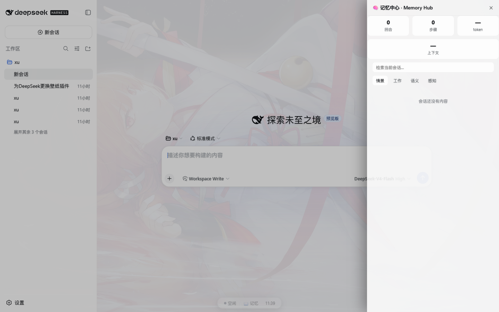
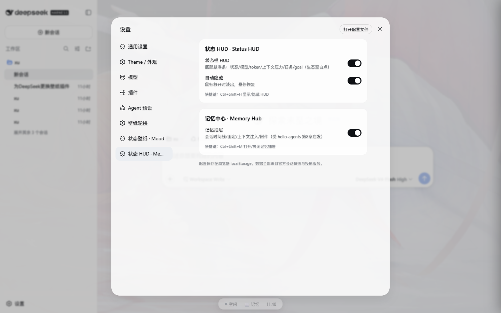

<div align="center">

# dsh-ui-hud 🧠

**DSH（DeepSeek Harness）状态 HUD + 会话记忆中心** —— 填补生态空白的 UI 增强插件：VSCode 式底部状态栏 HUD + 四种记忆类型可视化面板。

[](https://www.npmjs.com/package/dsh-ui-hud)
[](LICENSE)
[](https://github.com/deepseek-ai/deepseek-harness)
[](package.json)

> 灵感来源：[Datawhale hello-agents 第8章《记忆与检索》](https://datawhalechina.github.io/hello-agents/#/./chapter8/%E7%AC%AC%E5%85%AB%E7%AB%A0%20%E8%AE%B0%E5%BF%86%E4%B8%8E%E6%A3%80%E7%B4%A2)——把「工作/情景/语义/感知」四种记忆类型做成了可视化面板。

</div>

---

## ✨ 特性一览

### 1️⃣ 状态栏 HUD（生态空白点：VSCode 式底部状态栏）

```
[● 思考中 12s] [DeepSeek-V4-Flash] [⚡ 12.4k] [上下文 ▓▓▓░░ 62%] [⚙ 2 任务] [🎯 目标] [📖 记忆] [12:34]
```

- **状态 pill**：空闲 / 思考中（实时计时）/ 完成 / 错误 / 待命
- **当前模型**（assistant 节点 provenance）、**token 用量**（tokenUsage 投影）
- **上下文压力条**（contextPressure；>85% 变红）、**后台任务数**（jobsBySession）、**goal 阶段**（goal 投影）
- **点击展开详情**：sessionStats（回合/步骤/LLM 耗时/工具耗时/首 token 延迟）
- **自动隐藏**：鼠标移开淡出、悬停恢复（可关）

### 2️⃣ 记忆中心 · Memory Hub（生态空白点：记忆可视化面板）

| 页签 | hello-agents 对应 | 内容 |
|---|---|---|
| **情景** | Episodic | 会话时间线：用户/助手/工具/压缩/上下文注入/错误，可 **★ 固定** 重要条目 |
| **工作** | Working | 当前回合流式输出 + 固定的消息（localStorage 持久化） |
| **语义** | Semantic | 上下文注入卡片（context 节点 + provenance 来源标签） |
| **感知** | Sensory | 会话中的图片附件墙 |
| 检索框 | — | 对当前会话关键词过滤 |
| 统计行 | — | 回合 / 步骤 / token / 上下文占用 |

### 3️⃣ 快捷键 & 设置

- `Ctrl+Shift+H` 显示/隐藏 HUD · `Ctrl+Shift+M` 打开/关闭记忆抽屉
- **设置 → 状态 HUD · Memory**：HUD 开关、自动隐藏、记忆抽屉开关

## 🚀 安装（一条命令）

```powershell
# 一键脚本（推荐）：GitHub 直装两个插件（本插件 + dsh-mood-wallpaper），免 npm
irm https://raw.githubusercontent.com/wzyn20051216/dsh-mood-wallpaper/master/install.ps1 | iex

# 或手动 GitHub 直装（无需 npm）
dsh plugin --profile web add github:wzyn20051216/dsh-ui-hud
dsh plugin --profile web add github:wzyn20051216/dsh-mood-wallpaper

# 或本地源码调试（改源码后重启 dsh web 生效）
dsh plugin --profile web add <本仓库路径>
```

安装后**重启 `dsh web`** 生效。卸载：

```bash
dsh plugin --profile web remove dsh-ui-hud
```

> 无需 npm 账号：`github:user/repo` 直装由 pnpm 从 GitHub 拉取，本仓库无构建脚本，一条命令即可装到任何人的 DSH。

## 📸 截图

| 记忆中心抽屉 | 设置页 |
|---|---|
|  |  |

## 🏗️ 工作原理

```
        ctx.sessions（官方快照订阅）────────────────┐
        projections.faceOf('tokenUsage'/'contextPressure'  ├─→ 状态栏 HUD
                          /'sessionStats'/'goal')          │
        ctx.sessions.list（jobsBySession）─────────────────┘
                                                            │
        ConversationSnapshot.nodes ──→ 记忆中心抽屉         │
          （user/assistant/tool-result/context/compaction/  ├─→ 情景/语义/感知
            turn-error + partial + pending）                │    工作（+★固定）
                                                            ▼
        全部来自官方服务，无注入、无 DOM 抓取
```

## 📦 结构

```
dsh-ui-hud/
├── package.json     # dsh.bundle + dsh.client 声明
├── cordis.patch.yml # bundle 组合补丁（插入 ui-hud 入口）
├── docs/            # 截图
└── lib/
    ├── index.js     # host 半边（空激活载体）
    └── client.js    # 浏览器半边：HUD + 记忆抽屉 + 快捷键 + 设置页
```

## 🔌 兼容性

- 纯原生 DSH 插件（`dsh.bundle` + `dsh.client`）
- HUD/抽屉为私有 fixed 元素（类前缀 `dshhud-`，z-index 8000 级，低于应用弹层）
- 数据全部来自**官方会话快照与投影服务**，随 DSH 更新稳定
- 与 [dsh-mood-wallpaper](https://github.com/wzyn20051216/dsh-mood-wallpaper)（壁纸引擎）等插件共存

## 🧪 冒烟测试

- HUD 栏渲染（状态/计时/时钟）、记忆抽屉 4 页签 + 统计 + 检索、设置分节 ✅
- E2E（mock LLM）：发消息 → HUD「思考中 1s」→ 完成 →「空闲」✅
- 一条命令安装（全新 profile + tarball）验证通过 ✅

## 🤝 贡献

欢迎 PR！开发提示：改 `lib/` 后重启 `dsh web` 生效；`node --check lib/client.js` 做语法校验。

## 📄 License

[MIT](LICENSE)
